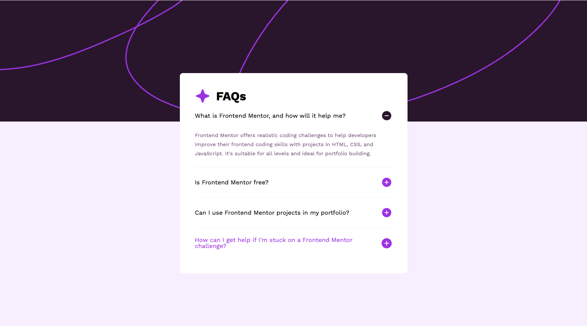

# Frontend Mentor - FAQ accordion solution

This is a solution to the
[FAQ accordion challenge on Frontend Mentor](https://www.frontendmentor.io/challenges/faq-accordion-wyfFdeBwBz).
Frontend Mentor challenges help you improve your coding skills by building
realistic projects.

## Table of contents

- [Overview](#overview)
  - [The challenge](#the-challenge)
  - [Screenshot](#screenshot)
  - [Links](#links)
- [My process](#my-process)
  - [Built with](#built-with)
  - [What I learned](#what-i-learned)
  - [Continued development](#continued-development)
  - [Useful resources](#useful-resources)
- [Author](#author)

## Overview

### The challenge

Users should be able to:

- Hide/Show the answer to a question when the question is clicked
- Navigate the questions and hide/show answers using keyboard navigation alone
- View the optimal layout for the interface depending on their device's screen
  size
- See hover and focus states for all interactive elements on the page

### Screenshot



### Links

- Solution URL:
  [GitHub Repository](https://github.com/kmje405/fem-faq-accordion)
- Live Site URL: [Live Demo](https://yourusername.github.io/fem-faq-accordion)

## My process

### Built with

- Semantic HTML5 markup
- CSS custom properties (CSS variables)
- CSS Grid for accordion prompt layout
- Flexbox for overall layout
- Mobile-first workflow
- Vanilla JavaScript for interactions
- CSS transitions and animations
- ARIA attributes for accessibility
- Work Sans font family
- Responsive design with rem units

### What I learned

This project taught me several important concepts about building accessible and
responsive components:

**Semantic HTML for Accordions:**

```html
<button class="accordion__item--prompt" aria-expanded="true" id="faq-1">
  What is Frontend Mentor, and how will it help me?
  
</button>
<div class="accordion__item--response" role="region" aria-labelledby="faq-1">
  <p>Frontend Mentor offers realistic coding challenges...</p>
</div>
```

**CSS Grid for Perfect Button Layout:**

```css
.accordion__item--prompt {
  display: grid;
  grid-template-columns: 1fr auto;
  align-items: center;
  gap: 1.5rem;
}
```

**Smooth Height Transitions:**

```css
.accordion__item--response {
  max-height: 200px;
  opacity: 1;
  transition: max-height 0.3s ease-out, opacity 0.3s ease-out,
    padding 0.3s ease-out;
}

.hidden {
  max-height: 0 !important;
  opacity: 0 !important;
  padding-block: 0 !important;
  transition: max-height 0.4s ease-in, opacity 0.4s ease-in,
    padding 0.4s ease-in;
}
```

**Accessible JavaScript Interactions:**

```js
function toggleAccordion(button) {
  const accordionItem = button.closest(".accordion__item");
  const response = accordionItem.querySelector(".accordion__item--response");
  const toggleIcon = button.querySelector(".toggle");

  const isHidden = response.classList.toggle("hidden");
  button.setAttribute("aria-expanded", !isHidden);

  if (isHidden) {
    toggleIcon.src = "assets/images/icon-plus.svg";
    toggleIcon.alt = "Expand answer";
  } else {
    toggleIcon.src = "assets/images/icon-minus.svg";
    toggleIcon.alt = "Collapse answer";
  }
}
```

**Responsive Background Images:**

```css
body::before {
  content: "";
  position: absolute;
  top: 0;
  left: 0;
  right: 0;
  height: calc(320 / 16 * 1rem);
  background-image: url(../assets/images/background-pattern-mobile.svg);
  background-size: cover;
  z-index: -1;
}

@media (min-width: calc(768 / 16 * 1rem)) {
  body::before {
    background-image: url(../assets/images/background-pattern-desktop.svg);
  }
}
```

### Continued development

Areas I want to continue focusing on in future projects:

- **Advanced CSS animations** - Exploring more complex transition effects and
  micro-interactions
- **CSS Container Queries** - Using modern responsive design techniques for
  component-based layouts
- **Web Components** - Building reusable accordion components with custom
  elements
- **Performance optimization** - Implementing lazy loading and optimizing for
  Core Web Vitals
- **Advanced accessibility** - Exploring screen reader testing and complex ARIA
  patterns

### Useful resources

- [ARIA Authoring Practices Guide - Accordion](https://www.w3.org/WAI/ARIA/apg/patterns/accordion/) -
  Essential reference for proper accordion accessibility implementation
- [CSS Tricks - Animating Height](https://css-tricks.com/using-css-transitions-auto-dimensions/) -
  Helped me understand the challenges and solutions for animating height
  transitions
- [MDN Web Docs - CSS Grid](https://developer.mozilla.org/en-US/docs/Web/CSS/CSS_Grid_Layout) -
  Comprehensive guide that helped me implement the perfect button layout
- [WebAIM - Keyboard Accessibility](https://webaim.org/techniques/keyboard/) -
  Crucial resource for implementing proper keyboard navigation

## Author

- Website -
  [Kevin Jones-Eastland | Eastland Jones Creative](https://eastlandjones.com/)
- Frontend Mentor - [@kmje405](https://www.frontendmentor.io/profile/kmje405)
- GitHub - [@yourusername](https://github.com/kmje405)
